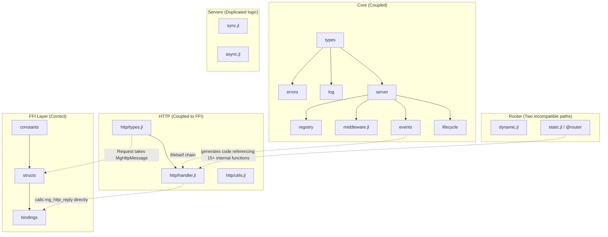

# Mongoose.jl — Architecture Review & Production Readiness Report

> **Status**: Technical assessment for v0.3.1
> **Goal**: Identify structural deficiencies, design coupling, and missing capabilities that prevent Mongoose.jl from competing with production-grade frameworks (FastAPI, Actix-web, Go's net/http, Fiber, Hono).
> **Audience**: Maintainers ready to do breaking refactors for a v1.0 release.

---

## Table of Contents

1. [Executive Summary](#1-executive-summary)
2. [Current Architecture Analysis](#2-current-architecture-analysis)
3. [Design Coupling & Structural Issues](#3-design-coupling--structural-issues)
4. [Missing Production Features](#4-missing-production-features)
5. [RFC & Standards Compliance Gaps](#5-rfc--standards-compliance-gaps)
6. [Performance Bottlenecks](#6-performance-bottlenecks)
7. [Proposed Architecture (v1.0)](#7-proposed-architecture-v10)
8. [Detailed Refactoring Plan](#8-detailed-refactoring-plan)
9. [Migration Roadmap](#9-migration-roadmap)

---

## 1. Executive Summary

### Strengths (keep these)
- **Zero-dependency runtime** — only `Mongoose_jll` + `PrecompileTools`
- **AOT compilation** — `@router` macro produces juliac-compatible static binaries
- **GC-safe C interop** — registry-based callback recovery eliminates pointer races
- **Performance-conscious** — custom hot-path functions, sharded locks, inline annotations
- **Clean precompilation** — comprehensive `@compile_workload` covers all critical paths

### Critical Issues (must fix for v1.0)

| Issue | Impact | Severity |
|-------|--------|----------|
| **Tight FFI coupling** — `Request` constructor takes `MgHttpMessage` directly | Untestable without C library, no mocking | 🔴 High |
| **Duplicated event handlers** — `_onevent!` for Server/Async share ~80% code | Maintenance burden, divergence risk | 🟡 Medium |
| **`Vector{Any}` route params** — forces boxing, prevents type inference | Performance hit on hot path | 🔴 High |
| **No middleware for StaticRouter** — completely bypasses pipeline | Trim-safe apps can't use middleware | 🔴 High |
| **No response streaming** — entire body buffered in memory | Can't serve large files from Julia, no SSE | 🔴 High |
| **No request lifecycle hooks** — no before/after request events | Can't implement tracing, cleanup, DI scopes | 🟡 Medium |
| **Binary response forces Connection: close** — `mg_send` path breaks keep-alive | Performance regression for binary endpoints | 🟡 Medium |
| **Global mutable state** — `REGISTRY`, `_TIMED_INFLIGHT`, shard locals | Testing difficulty, potential race conditions | 🟡 Medium |
| **No content negotiation** — no Accept header parsing | Manual format selection only | 🟡 Medium |
| **No structured error handling** — exceptions → string messages | No error codes, no machine-readable errors | 🟡 Medium |

---

## 2. Current Architecture Analysis

### Module Dependency Graph



### Design Pattern Assessment

| Pattern | Current | Best Practice |
|---------|---------|---------------|
| **Request/Response** | Concrete structs, FFI-coupled constructor | Abstract protocol with adapter layer |
| **Middleware** | Recursive closure pipeline | Composable chain with typed context |
| **Router** | Two incompatible implementations (dynamic trie / static macro) | Unified interface with specialization |
| **Error handling** | try/catch → string message → fixed response | Result type / error chain with context |
| **DI / Context** | `Dict{Symbol,Any}` lazily allocated | Typed service container / scoped providers |
| **Configuration** | `Config` struct, validated at construction | Layered config (defaults → env → file → runtime) |
| **Lifecycle** | `start!`/`shutdown!` imperative | Hook-based lifecycle with phases |

---

## 3. Design Coupling & Structural Issues

### 3.1 FFI Boundary Leaks Into Application Layer

**Problem**: `Request` is constructed directly from `MgHttpMessage`:

```julia
# Current: http/types.jl
Request(message::MgHttpMessage, method::Symbol, uri::String) = ...
```

This means:
- You cannot unit-test handlers without the C library loaded
- You cannot mock requests for benchmarking
- You cannot swap the transport layer (e.g., replace Mongoose C with a pure-Julia HTTP parser)
- The request struct is forever tied to the specific C struct layout

**Solution**: Introduce an adapter layer:

```julia
# FFI stays internal
_parse_request(msg::MgHttpMessage) → Request  # adapter function

# Request is constructed from pure Julia data only
Request(method, uri, query, headers, body)  # already exists as secondary constructor
```

### 3.2 Handler Dispatch Duplication

**Problem**: `_onevent!(::Server, ::Val{MG_EV_HTTP_MSG})` and `_onevent!(::Async, ::Val{MG_EV_HTTP_MSG})` differ only in whether they call the handler inline vs enqueue to a Channel.

```julia
# Both do:
# 1. Parse MgHttpMessage
# 2. Check WS routes
# 3. Check body size
# 4. Try static serve
# 5. Diverge: Server calls handler, Async enqueues
```

If you add a feature (e.g., request logging, trace propagation), you must update **both** functions identically.

**Solution**: Extract a shared `_preprocess` function that handles steps 1-4 and returns a decision enum:

```julia
@enum PreprocessResult UPGRADED STATIC_SERVED REJECTED DISPATCH_HTTP

function _preprocess(server, conn, ev_data) → (PreprocessResult, Request?)
```

### 3.3 Two Incompatible Router Systems

**Problem**: `Router` (dynamic) and `StaticRouter` (`@router` macro) implement the same concept with completely different code paths, different capabilities, and different APIs:

| Capability | Router (dynamic) | @router (static) |
|-----------|------------------|-------------------|
| Middleware | ✅ Full pipeline | ❌ Completely bypassed |
| Route registration | Runtime `route!()` | Compile-time macro |
| WebSocket | `ws!()` function | `ws()` DSL in macro |
| Parameter types | `Vector{Any}` | `SubString` / parsed at compile-time |
| Handler signature | `(req, params...)` | `(req, typed_params...)` |

This creates a **two-class citizen** problem: users who need AOT lose all middleware, and users who need middleware lose AOT performance.

**Solution**: Unified router protocol with compile-time specialization:

```julia
abstract type AbstractRouter end

# Required interface
dispatch(router::R, method::Symbol, uri::String, req::Request) → Response
has_ws_route(router::R, uri::String) → Bool
ws_endpoint(router::R, uri::String) → Union{Nothing, WsEndpoint}

# @router generates a type that implements this interface
# BUT also supports an optional middleware list compiled into the dispatch path
```

### 3.4 `Vector{Any}` Parameter Boxing

**Problem**: Route parameters are collected into `Vector{Any}`:

```julia
# router/dynamic.jl
params = Any[]
# ...
push!(params, parse(node.param_type, seg))
```

This forces:
- Heap allocation of the vector on every request
- Boxing of Int, Float64, etc. into Any
- Loss of type inference in handler bodies

The `@router` macro avoids this by generating typed locals, but dynamic `Router` users pay this cost on every request.

**Solution**: Use a typed tuple or `NamedTuple` generated at route registration time:

```julia
# At registration, store the expected parameter types
RouteEntry(handler, param_types::Tuple{Vararg{Type}})

# At dispatch, return a typed tuple
_match(router, method, path) → (handler, (typed_param1, typed_param2, ...))
```

### 3.5 Middleware Cannot Compose With Static Router

**Problem**: The `@router` macro generates a single `_dispatchstatic` function that **replaces** the entire dispatch pipeline. There's no hook point for middleware.

Users who want both AOT compilation AND middleware (e.g., CORS, auth, logging) have no option.

**Solution**: Generate middleware hooks at compile time:

```julia
@router MyApp begin
    # Middleware declarations (compiled into the dispatch path)
    use(cors(origins=["*"]))
    use(logger())

    get("/api/data", handler)
end
```

The macro would generate:

```julia
function _dispatchstatic(app::MyApp, req::Request)
    # Compiled middleware chain (inlined, no allocation)
    cors_result = _cors_check(req, CORS_CONFIG)
    cors_result !== nothing && return cors_result

    _logger_before(req)
    resp = _route_dispatch(app, req)  # the trie
    _logger_after(req, resp)
    return resp
end
```

### 3.6 No Connection Abstraction

**Problem**: Raw `MgConnection` (= `Ptr{Cvoid}`) is passed around and stored in `Dict{Int,MgConnection}`. Code that interacts with connections must use `ccall` directly.

This makes:
- Testing impossible without a real C connection
- Mocking for integration tests impossible
- Future transport swaps (QUIC, Unix sockets) require touching every handler

**Solution**: Introduce a `Connection` abstraction:

```julia
abstract type AbstractConnection end

struct HttpConnection <: AbstractConnection
    id::Int
    ptr::Ptr{Cvoid}  # internal, never exposed to users
end

# Only the FFI layer touches ptr
send!(conn::HttpConnection, response::Response)
close!(conn::HttpConnection)
```

---

## 4. Missing Production Features

### 4.1 Response Streaming & SSE (Critical)

FastAPI, Express, Go, Rust frameworks all support streaming responses. Without this, Mongoose.jl cannot:
- Serve large file downloads from Julia code (only C static serve works)
- Implement Server-Sent Events (SSE) for real-time updates
- Implement chunked transfer encoding for progressive rendering
- Stream AI model outputs (LLM token-by-token)

**Proposed API**:

```julia
function stream_handler(req)
    StreamResponse(200, "text/event-stream") do stream
        for i in 1:100
            write(stream, "data: event $i\n\n")
            flush(stream)
            sleep(0.1)
        end
    end
end
```

### 4.2 Dependency Injection / Service Container

Production frameworks provide DI for:
- Database connection pools
- Cache clients
- Configuration objects
- Authentication services

**Current state**: Only `context!(req)::Dict{Symbol,Any}` — untyped, per-request only.

**Proposed API**:

```julia
# Application-level services (singleton lifetime)
services = Services()
register!(services, :db, () -> connect_db(ENV["DATABASE_URL"]))
register!(services, :cache, () -> RedisClient())

server = Server(router, services=services)

# In handler — type-safe service access
function handler(req)
    db = service(req, :db)::DatabaseConnection
    # ...
end
```

### 4.3 Request Validation & Schema

FastAPI's killer feature is Pydantic-based request validation. Mongoose.jl has zero validation.

**Proposed API** (using Julia's type system):

```julia
@schema struct CreateUser
    name::String
    email::String
    age::Int = 25  # default value
end

function create_user(req, body::CreateUser)
    # body is already validated and typed
    Response(Json, serialize(body))
end

route!(router, :post, "/users", create_user; body=CreateUser)
```

### 4.4 Route Groups & Middleware Scoping

**Current**: Middleware applies globally or via `PathFilter` string prefix matching.

**Needed**: Nested router groups with scoped middleware:

```julia
api = group("/api/v1") do
    use(bearer(validate_token))
    use(ratelimit(100, 60))

    get("/users", list_users)
    post("/users", create_user)

    admin = group("/admin") do
        use(require_role("admin"))
        delete("/users/:id", delete_user)
    end
end

route!(router, api)
```

### 4.5 Content Negotiation

**Current**: Response format is hardcoded per handler. No `Accept` header parsing.

**Needed**:

```julia
function get_user(req, id)
    user = find_user(id)
    negotiate(req, user,
        Json => serialize_json,
        Xml  => serialize_xml,
        Html => render_template
    )
end
```

### 4.6 Cookie & Session Management

**Current**: No cookie parsing. Raw `Set-Cookie` header must be constructed manually.

**Needed**:

```julia
function login(req)
    # Parse cookies from request
    session_id = cookie(req, "session_id")

    # Set cookies in response
    Response(Json, "{}";
        cookies=[Cookie("session_id", new_id; httponly=true, secure=true, samesite=:strict)])
end
```

### 4.7 Multipart Upload / Form Parsing

**Current**: `req.body` is a raw `String`. No multipart boundary parsing.

**Needed**:

```julia
function upload(req)
    form = parse_multipart(req)
    file = form["avatar"]  # UploadedFile(name, content_type, data)
    save(file, "/uploads/$(file.name)")
    Response(201, "", "")
end
```

### 4.8 Graceful Hot Reload (Development Mode)

**Current**: Must restart server to apply code changes.

**Needed** (dev mode only):

```julia
# With Revise.jl integration
start!(server, port=8080, watch=true)  # auto-reload on file changes
```

### 4.9 OpenAPI / Swagger Auto-Generation

FastAPI generates OpenAPI specs automatically from type annotations.

**Needed**:

```julia
@api struct GetUser
    summary = "Get user by ID"
    params = (id::Int,)
    responses = [200 => User, 404 => ErrorResponse]
end

# Auto-generate /openapi.json and /docs (Swagger UI)
plug!(server, openapi(title="My API", version="1.0"))
```

### 4.10 Background Tasks & Job Queue

**Current**: No way to schedule work outside request/response cycle.

**Needed**:

```julia
function create_order(req)
    order = save_order(req.body)
    # Fire-and-forget background work
    enqueue!(server, :send_email, order.id)
    Response(Json, serialize(order); status=202)
end

# Worker registration
background!(server, :send_email) do order_id
    send_confirmation_email(order_id)
end
```

---

## 5. RFC & Standards Compliance Gaps

### 5.1 HTTP/1.1 (RFC 9110, 9112)

| Requirement | Status | Issue |
|------------|--------|-------|
| `Transfer-Encoding: chunked` | ❌ Not supported | Cannot stream responses |
| `100 Continue` | ❌ Not supported | Large uploads may fail with strict proxies |
| `Expect` header handling | ❌ Ignored | Related to 100-continue |
| `Host` header validation | ⚠️ Delegated to C lib | No virtual host routing |
| `Content-Length` for responses | ⚠️ Set by C lib | Binary path uses manual send |
| `Connection: keep-alive` | ⚠️ Broken for binary responses | `mg_send` forces close |
| `HEAD` response (no body) | ✅ Handled | Auto-strips body in @router |
| `405 Method Not Allowed` | ✅ With `Allow` header | Only in @router |
| `OPTIONS` | ✅ Via CORS middleware | Not auto-generated for routes |

### 5.2 WebSocket (RFC 6455)

| Requirement | Status | Issue |
|------------|--------|-------|
| Ping/Pong | ✅ Correct | Auto-pong on ping |
| Close frame echo | ✅ Correct | Proper close handshake |
| Subprotocol negotiation | ❌ Not supported | `Sec-WebSocket-Protocol` ignored |
| Per-message compression (RFC 7692) | ❌ Not supported | No `permessage-deflate` |
| Maximum frame size enforcement | ✅ Via `max_body` | Shared with HTTP (should be separate) |
| Binary frame support | ✅ Correct | Opcode-based text/binary detection |

### 5.3 CORS (Fetch Standard / W3C)

| Requirement | Status | Issue |
|------------|--------|-------|
| Origin validation | ⚠️ Static list only | No regex, no dynamic validation |
| Preflight caching (`Access-Control-Max-Age`) | ✅ Configurable | |
| `Vary: Origin` header | ❌ Not set | Breaks caching with multiple origins |
| Credentialed requests | ⚠️ Flag exists | No validation of `withCredentials` vs wildcard |

### 5.4 Security Headers

| Header | Status | Impact |
|--------|--------|--------|
| `X-Content-Type-Options: nosniff` | ❌ Not set | MIME sniffing attacks |
| `X-Frame-Options` | ❌ Not set | Clickjacking |
| `Strict-Transport-Security` | ❌ Not set | TLS downgrade attacks |
| `Content-Security-Policy` | ❌ Not set | XSS protection |
| `X-Request-Id` echo | ✅ Sanitized | Injection-safe |

---

## 6. Performance Bottlenecks

### 6.1 Allocation Hot Spots

| Location | Allocation | Frequency | Fix |
|----------|-----------|-----------|-----|
| `Request` construction | String copies from C | Every request | Pre-sized buffer pool |
| `_headers` parsing | `Vector{Pair}` + `lowercase()` | Every request | Stack-allocated header buffer |
| `_pipeline` closures | One closure per middleware per request | Every request × N middlewares | Pre-built function chain |
| `_query2dict` | `Dict{String,String}` + `split` | Every request with query | Lazy parsing, view-based |
| `Response` header formatting | String concatenation | Every response | Pre-formatted header buffers |
| `Vector{Any}` params | Boxed parameters | Every parametric route hit | Typed tuples |

### 6.2 Lock Contention Points

| Lock | Contention Pattern | Fix |
|------|-------------------|-----|
| `REGISTRY` SpinLock | Every C callback does a registry lookup | Thread-local cache or eliminate registry |
| Rate limiter shards (16) | High-QPS APIs hit same shard | Scale shards with nthreads |
| Metrics shards (8) | Under-sharded for high thread counts | Auto-tune to `2 * nthreads()` |
| `Async.connections` Dict | Event loop + workers access | Lock-free concurrent map or channel-based |

### 6.3 Event Loop Stalls

| Stall Source | Impact | Fix |
|-------------|--------|-----|
| `_staticexists` does `isfile()` syscalls | Blocks event loop on filesystem I/O | Cache file existence / async I/O |
| `_servestatic!` calls `mg_http_serve_dir` | Reads file from disk on event loop | Background thread for large files |
| `_wsidlesweep!` iterates all WS clients | O(n) scan every 5 seconds | Priority queue / timer wheel |
| `_drain` polls in tight loop | CPU spin during shutdown | Condition variable with timeout |

### 6.4 Memory Usage

| Issue | Impact | Fix |
|-------|--------|-----|
| Full body copied to Julia String | 2x memory per request | Zero-copy view with GC pin |
| All headers copied | ~30 allocations per request | View-based header access |
| WS message `copy(unsafe_wrap(...))` | Extra copy for safety | Pin buffer lifetime to callback scope |
| `Dict{Int,MgConnection}` in Async | Unbounded growth under load | Bounded map with eviction |

---

## 7. Proposed Architecture (v1.0)

### 7.1 Layered Architecture

```
┌─────────────────────────────────────────────────────────┐
│                    User Application                       │
├─────────────────────────────────────────────────────────┤
│  Router Interface  │  Middleware Chain  │  Services/DI   │
├─────────────────────────────────────────────────────────┤
│  Request/Response Protocol (abstract, transport-agnostic)│
├─────────────────────────────────────────────────────────┤
│  Transport Adapter (Mongoose C / future: pure Julia)     │
├─────────────────────────────────────────────────────────┤
│  FFI Layer (bindings, structs, constants)                │
└─────────────────────────────────────────────────────────┘
```

### 7.2 Core Design Principles

1. **Transport Independence** — Request/Response types never reference FFI structs
2. **Composable Middleware** — Works for both dynamic and static routers
3. **Type-Safe Parameters** — Route params are typed tuples, not `Vector{Any}`
4. **Extensible via Protocols** — Abstract types with required method interfaces
5. **Zero-Cost Abstractions** — Static dispatch and inlining eliminate abstraction overhead
6. **Testability** — Every component mockable without C library

### 7.3 New Module Structure

```
src/
├── Mongoose.jl                  # Module entry, exports
├── protocol/                    # Transport-agnostic types
│   ├── request.jl              # Request struct (pure Julia)
│   ├── response.jl             # Response struct + streaming
│   ├── formats.jl              # Content types, negotiation
│   ├── cookies.jl              # Cookie parsing/setting
│   └── context.jl              # Typed request context + DI
├── router/
│   ├── interface.jl            # AbstractRouter protocol
│   ├── trie.jl                 # Trie data structure (shared)
│   ├── dynamic.jl              # Runtime router
│   ├── static.jl              # @router macro
│   ├── groups.jl               # Route groups / nesting
│   └── params.jl               # Parameter parsing + types
├── middleware/
│   ├── pipeline.jl             # Middleware chain execution
│   ├── interface.jl            # AbstractMiddleware protocol
│   ├── cors.jl
│   ├── ratelimit.jl
│   ├── auth.jl
│   ├── logger.jl
│   ├── health.jl
│   ├── metrics.jl
│   ├── security.jl            # Security headers
│   └── compression.jl         # Response compression
├── transport/
│   ├── adapter.jl             # Transport → Request/Response bridge
│   ├── mongoose/              # Mongoose C backend
│   │   ├── bindings.jl
│   │   ├── constants.jl
│   │   ├── structs.jl
│   │   ├── connection.jl      # Connection abstraction
│   │   └── events.jl          # Event dispatch
│   └── interface.jl           # AbstractTransport protocol
├── server/
│   ├── core.jl                # ServerCore shared state
│   ├── sync.jl                # Single-threaded server
│   ├── async.jl               # Multi-threaded server
│   ├── lifecycle.jl           # start!/shutdown!/drain
│   └── registry.jl            # Server registry
├── ws/
│   ├── types.jl
│   ├── handler.jl
│   ├── router.jl
│   └── rooms.jl               # Broadcast / room support
├── streaming/
│   ├── chunked.jl             # Chunked transfer encoding
│   └── sse.jl                 # Server-Sent Events
└── util/
    ├── log.jl
    ├── errors.jl
    └── strings.jl             # String utilities
```

### 7.4 Key Interface Definitions

```julia
# --- Transport-agnostic Request ---
struct Request
    method::Symbol
    uri::String
    path::String           # URI without query string (pre-stripped)
    query::QueryParams     # Lazy-parsed query parameters
    headers::Headers       # O(1) lookup via pre-hashed keys
    body::Body             # Lazy: raw bytes, parsed JSON, or multipart
    context::Context       # Typed DI container
end

# --- Streaming-capable Response ---
abstract type AbstractResponse end

struct Response <: AbstractResponse
    status::Int
    headers::ResponseHeaders
    body::Union{String, Vector{UInt8}}
end

struct StreamResponse <: AbstractResponse
    status::Int
    headers::ResponseHeaders
    producer::Function  # (stream::IO) -> nothing
end

# --- Typed middleware ---
abstract type AbstractMiddleware end

# Middleware returns either a Response (short-circuit) or nothing (continue)
struct MiddlewareResult
    response::Union{Nothing, AbstractResponse}
end

# Compile-time composable chain
struct MiddlewareChain{T <: Tuple}
    middlewares::T
end

# --- Router protocol ---
abstract type AbstractRouter end

struct RouteMatch{P}
    handler::Function
    params::P           # NamedTuple, not Vector{Any}
    middleware::Union{Nothing, MiddlewareChain}
end

# Required methods:
# dispatch(router::R, method::Symbol, path::String) → Union{Nothing, RouteMatch}
# ws_endpoint(router::R, path::String) → Union{Nothing, WsEndpoint}
```

---

## 8. Detailed Refactoring Plan

### Phase 1: Foundation (Non-Breaking Internal Refactor)

#### 1.1 Extract Transport Adapter Layer

**Goal**: Decouple `Request` construction from `MgHttpMessage`.

```julia
# New: transport/adapter.jl
function adapt_request(msg::MgHttpMessage, method::Symbol, uri::String)::Request
    # All FFI-to-Julia conversion happens here
    # Request constructor only takes pure Julia types
end
```

**Changes**:
- Move `Request(::MgHttpMessage, ...)` logic into `adapt_request`
- `Request` keeps its current fields but constructor only accepts Julia types
- All internal code calls `adapt_request` → `Request`

**Files affected**: `http/types.jl`, `http/handler.jl`, `ws/handler.jl`

#### 1.2 Unify Event Handler Dispatch

**Goal**: Eliminate duplication between Server and Async HTTP handlers.

```julia
# New shared preprocessing
function _preprocess_http(server::AbstractServer, conn, ev_data)
    message = MgHttpMessage(ev_data)
    method = _method(message)
    uri = _uri(message)

    # WS upgrade check
    if _haswsroutes(server.core.router)
        endpoint = _wsep(server.core.router, uri)
        if endpoint !== nothing
            _wsupgrade!(server, conn, ev_data, uri, endpoint, message)
            return nothing  # handled
        end
    end

    # Body size check
    if message.body.len > server.core.max_body
        return _errresponse(server, 413)  # reject
    end

    # Static serve
    _servestatic!(server, conn, ev_data, method, uri) && return nothing

    return adapt_request(message, method, uri)  # needs dispatch
end
```

**Files affected**: `http/handler.jl`

#### 1.3 Typed Route Parameters

**Goal**: Replace `Vector{Any}` with typed parameter tuples.

```julia
# New: router/params.jl
struct TypedParams{T <: Tuple}
    values::T
end

# At registration, compute parameter types
struct RouteEntry{P <: Tuple}
    handler::Function
    param_types::Type{P}
end

# At dispatch, return typed params
function _match(router, method, path) → Union{Nothing, (Function, TypedParams)}
```

**Implementation Strategy**:
- Keep `Vector{Any}` as internal storage during trie matching (allocation is unavoidable for dynamic routes)
- Convert to `Tuple` at the dispatch boundary using `ntuple` + `@generated`
- For the common case (0-2 params), specialize with manual unrolling

**Files affected**: `router/dynamic.jl`, `http/handler.jl`

---

### Phase 2: Middleware Unification (Breaking)

#### 2.1 New Middleware Protocol

```julia
# middleware/interface.jl
abstract type AbstractMiddleware end

# Before-request hook: can short-circuit with a Response
before(mw::AbstractMiddleware, req::Request)::Union{Nothing, Response} = nothing

# After-request hook: can transform the response
after(mw::AbstractMiddleware, req::Request, resp::Response)::Response = resp

# Full control (replaces current 3-arg pattern for complex middleware)
function invoke(mw::AbstractMiddleware, req::Request, next::Function)::Response
    before_result = before(mw, req)
    before_result !== nothing && return before_result
    resp = next()
    return after(mw, req, resp)
end
```

**Benefits**:
- `before`/`after` pattern is simpler than `(req, params, next)` for most middleware
- Full `invoke` available for middleware that needs to wrap (timing, error handling)
- Can be compiled into static dispatch for `@router`

#### 2.2 Middleware in @router (Compile-Time Pipeline)

```julia
@router MyApp begin
    # Global middleware (applied to all routes)
    use(cors(origins=["*"]))
    use(logger())

    # Route-specific middleware via groups
    group("/api", middleware=[bearer(validate)]) do
        get("/users", list_users)
    end

    get("/health", health_check)  # no auth middleware
end
```

The macro generates:

```julia
function _dispatchstatic(app::MyApp, req::Request)
    # Global before-hooks (inlined)
    cors_resp = Mongoose._cors_before(req, app._cors_config)
    cors_resp !== nothing && return cors_resp

    # Route dispatch
    resp = _route_dispatch(app, req)

    # Global after-hooks (inlined)
    resp = Mongoose._cors_after(req, resp, app._cors_config)
    resp = Mongoose._logger_after(req, resp)
    return resp
end
```

**Key Insight**: Each middleware must expose `_before` and `_after` as standalone functions (not closures) for the macro to inline them. This is a new protocol requirement.

#### 2.3 Route Groups & Nesting

```julia
# router/groups.jl
struct RouteGroup
    prefix::String
    middleware::Vector{AbstractMiddleware}
    routes::Vector{Tuple{Symbol, String, Function}}
    children::Vector{RouteGroup}
end

function group(prefix::String; middleware=AbstractMiddleware[])
    RouteGroup(prefix, middleware, [], [])
end

# Registration flattens groups into the trie with middleware annotations
function route!(router::Router, group::RouteGroup)
    for (method, path, handler) in group.routes
        full_path = group.prefix * path
        route!(router, method, full_path, handler; middleware=group.middleware)
    end
end
```

---

### Phase 3: Response Streaming & SSE

#### 3.1 Chunked Response Protocol

```julia
# streaming/chunked.jl
struct StreamResponse
    status::Int
    headers::String
    producer::Function  # (io::ChunkedIO) -> nothing
end

mutable struct ChunkedIO <: IO
    conn::Ptr{Cvoid}
    open::Bool
end

function Base.write(io::ChunkedIO, data::Union{String, Vector{UInt8}})
    io.open || error("Stream closed")
    chunk = string(sizeof(data), base=16) * "\r\n" * data * "\r\n"
    mg_send(io.conn, chunk)
end

function Base.close(io::ChunkedIO)
    mg_send(io.conn, "0\r\n\r\n")  # final chunk
    io.open = false
end
```

#### 3.2 Server-Sent Events

```julia
# streaming/sse.jl
struct SSEResponse
    status::Int
    producer::Function  # (sse::SSEStream) -> nothing
end

mutable struct SSEStream
    conn::Ptr{Cvoid}
    open::Bool
end

function event!(sse::SSEStream; data::String, event::String="", id::String="")
    msg = ""
    !isempty(id) && (msg *= "id: $id\n")
    !isempty(event) && (msg *= "event: $event\n")
    for line in split(data, '\n')
        msg *= "data: $line\n"
    end
    msg *= "\n"
    mg_send(sse.conn, msg)
end
```

**Challenge**: Streaming requires the connection to stay open across multiple event loop iterations. This means:
- For `Server` (sync): streaming blocks the event loop (unacceptable)
- For `Async`: streaming must happen on a worker thread with access to the connection

**Solution**: Streaming only supported in `Async` mode. The worker holds the connection open and writes chunks via a dedicated reply type.

---

### Phase 4: DI, Validation & Developer Experience

#### 4.1 Service Container

```julia
# protocol/context.jl
struct ServiceRegistry
    factories::Dict{Symbol, Function}
    singletons::Dict{Symbol, Any}
    lock::ReentrantLock
end

function service(registry::ServiceRegistry, key::Symbol)
    # Singleton: create once, return cached
    haskey(registry.singletons, key) && return registry.singletons[key]
    lock(registry.lock) do
        haskey(registry.singletons, key) && return registry.singletons[key]
        instance = registry.factories[key]()
        registry.singletons[key] = instance
        return instance
    end
end

# Attach to server
struct Server{R}
    core::ServerCore{R}
    services::ServiceRegistry
end

# Access in handlers via request context
function service(req::Request, key::Symbol)
    return service(req.context.services, key)
end
```

#### 4.2 Request Validation

```julia
# New: ext/MongooseValidationExt.jl (package extension)
# Uses StructTypes.jl or similar for schema definition

macro schema(expr)
    # Generate: struct definition + validation function + JSON parsing
end

function validate(req::Request, ::Type{T})::Union{T, Response} where T
    try
        parsed = parse_json(req.body, T)
        errors = _validate_fields(parsed)
        isempty(errors) && return parsed
        return Response(Json, serialize_errors(errors); status=422)
    catch e
        return Response(Json, "{\"error\":\"invalid JSON\"}"; status=400)
    end
end
```

#### 4.3 Cookie Support

```julia
# protocol/cookies.jl
struct Cookie
    name::String
    value::String
    path::String
    domain::String
    expires::Union{Nothing, Float64}
    max_age::Union{Nothing, Int}
    secure::Bool
    httponly::Bool
    samesite::Symbol  # :strict, :lax, :none
end

# Parse from request
function cookies(req::Request)::Dict{String, String}
    # Parse Cookie header (lazy, cached in context)
end

function cookie(req::Request, name::String)::Union{Nothing, String}
    get(cookies(req), name, nothing)
end

# Set in response
function Response(format, body; cookies::Vector{Cookie}=Cookie[], kwargs...)
    # Serialize cookies into Set-Cookie headers
end
```

---

### Phase 5: Observability & Security

#### 5.1 Security Headers Middleware

```julia
# middleware/security.jl
struct SecurityHeaders <: AbstractMiddleware
    hsts::String
    csp::String
    frame_options::String
    content_type_options::String
end

function security(;
    hsts_max_age::Int = 31536000,
    frame_options::String = "DENY",
    csp::String = "default-src 'self'",
    nosniff::Bool = true
)
    SecurityHeaders(
        "max-age=$hsts_max_age; includeSubDomains",
        csp,
        frame_options,
        nosniff ? "nosniff" : ""
    )
end

function after(mw::SecurityHeaders, req::Request, resp::Response)::Response
    # Append security headers to response
end
```

#### 5.2 OpenTelemetry Integration

```julia
# ext/MongooseOTelExt.jl (package extension, triggered by OpenTelemetry.jl)
struct TracingMiddleware <: AbstractMiddleware
    tracer::Tracer
end

function invoke(mw::TracingMiddleware, req::Request, next::Function)
    span = start_span(mw.tracer, "HTTP $(req.method) $(req.uri)")
    set_attribute(span, "http.method", string(req.method))
    set_attribute(span, "http.url", req.uri)
    try
        resp = next()
        set_attribute(span, "http.status_code", resp.status)
        return resp
    catch e
        record_exception(span, e)
        rethrow(e)
    finally
        end_span(span)
    end
end
```

#### 5.3 Structured Error Chain

```julia
# util/errors.jl
struct AppError <: Exception
    code::Symbol         # :not_found, :unauthorized, :validation_failed
    message::String
    status::Int
    details::Union{Nothing, Dict{String,Any}}
    cause::Union{Nothing, Exception}
end

# Error handler registration
function on_error!(server, handler::Function)
    # handler(req, error) → Response
end

# Default error → Response mapping
function _error_to_response(err::AppError)::Response
    body = "{\"error\":\"$(err.code)\",\"message\":\"$(err.message)\"}"
    if err.details !== nothing
        body = "{\"error\":\"$(err.code)\",\"message\":\"$(err.message)\",\"details\":$(serialize(err.details))}"
    end
    Response(Json, body; status=err.status)
end
```

---

## 9. Migration Roadmap

### v0.4.0 — Foundation (Non-breaking)

| Task | Effort | Breaking? |
|------|--------|-----------|
| Extract transport adapter (`adapt_request`) | 1 day | No |
| Unify `_onevent!` dispatch (shared `_preprocess_http`) | 1 day | No |
| Add `Headers` struct with O(1) lookup | 2 days | No (internal) |
| Fix binary response keep-alive (use chunked encoding) | 1 day | No |
| Add `Vary: Origin` to CORS middleware | 0.5 day | No |
| Add security headers middleware | 1 day | No |
| Separate `ws_max_frame` from `max_body` | 0.5 day | No |
| Add cookie parsing utility | 1 day | No |
| **Total** | ~8 days | |

### v0.5.0 — Router Unification (Breaking)

| Task | Effort | Breaking? |
|------|--------|-----------|
| Typed route parameters (replace `Vector{Any}`) | 3 days | ⚠️ Handler signatures change |
| Route groups with prefix + scoped middleware | 2 days | New API (additive) |
| Middleware `before`/`after` protocol | 2 days | ⚠️ Middleware signature change |
| `@router` middleware support (`use()` directive) | 3 days | ⚠️ Macro syntax extended |
| Wildcard `*path` as proper `SubString` (not `String`) | 0.5 day | ⚠️ Type change |
| Auto-`OPTIONS` response with `Allow` header | 1 day | No |
| Content negotiation (`negotiate()` helper) | 1 day | No |
| **Total** | ~12.5 days | |

### v0.6.0 — Streaming & Advanced HTTP (Breaking)

| Task | Effort | Breaking? |
|------|--------|-----------|
| `StreamResponse` type + chunked transfer | 3 days | New type (additive) |
| SSE support (`SSEResponse` + `event!()`) | 2 days | New type (additive) |
| Multipart upload parsing | 3 days | New API (additive) |
| Request body lazy parsing (JSON, form, multipart) | 2 days | ⚠️ `req.body` becomes lazy |
| Connection abstraction (hide `Ptr{Cvoid}`) | 2 days | No (internal) |
| Background task queue | 2 days | New API (additive) |
| **Total** | ~14 days | |

### v0.7.0 — DI, Validation & Developer Experience

| Task | Effort | Breaking? |
|------|--------|-----------|
| Service container / DI | 2 days | New API (additive) |
| Request validation extension (`@schema` macro) | 3 days | Extension (opt-in) |
| Session middleware (cookie-based) | 2 days | New middleware (additive) |
| Development mode with Revise.jl integration | 1 day | New option (additive) |
| Error handler registration (`on_error!`) | 1 day | New API (additive) |
| Structured `AppError` type | 1 day | ⚠️ Error type change |
| **Total** | ~10 days | |

### v0.8.0 — Observability & Ecosystem

| Task | Effort | Breaking? |
|------|--------|-----------|
| OpenTelemetry extension | 2 days | Extension (opt-in) |
| OpenAPI auto-generation extension | 3 days | Extension (opt-in) |
| JSON extension (zero-copy integration) | 2 days | Extension (opt-in) |
| Prometheus metric labels (route pattern) | 1 day | ⚠️ Metric format change |
| Auto-tune shard counts based on nthreads | 0.5 day | No |
| WebSocket rooms / broadcast | 2 days | New API (additive) |
| WebSocket subprotocol negotiation | 1 day | No |
| **Total** | ~11.5 days | |

### v1.0.0 — Production Release

| Task | Effort | Breaking? |
|------|--------|-----------|
| API stabilization & documentation | 3 days | No |
| Comprehensive benchmark suite | 2 days | No |
| Migration guide from v0.3 → v1.0 | 1 day | No |
| CI benchmark regression detection | 1 day | No |
| Security audit (OWASP Top 10 review) | 1 day | No |
| Performance profiling & optimization pass | 2 days | No |
| **Total** | ~10 days | |

---

## Appendix A: Comparison with Production Frameworks

### FastAPI (Python) — Feature Parity Target

| Feature | FastAPI | Mongoose.jl v0.3 | Mongoose.jl v1.0 (planned) |
|---------|---------|-------------------|---------------------------|
| Automatic OpenAPI docs | ✅ | ❌ | ✅ (extension) |
| Request validation | ✅ (Pydantic) | ❌ | ✅ (@schema macro) |
| Dependency injection | ✅ (Depends()) | ❌ | ✅ (ServiceRegistry) |
| Middleware | ✅ | ⚠️ (dynamic only) | ✅ (unified) |
| WebSocket | ✅ | ✅ | ✅ (+ rooms) |
| Background tasks | ✅ | ❌ | ✅ |
| Response streaming | ✅ | ❌ | ✅ |
| CORS | ✅ | ✅ | ✅ (improved) |
| Static files | ✅ | ✅ | ✅ |
| Cookie/Session | ✅ | ❌ | ✅ |
| Form/Multipart | ✅ | ❌ | ✅ |
| AOT compilation | ❌ | ✅ | ✅ |
| Type-safe routing | ❌ | ✅ | ✅ (improved) |
| Performance (RPS) | ~15k | ~100k+ | ~150k+ |

### Actix-web (Rust) — Performance Target

| Metric | Actix-web | Mongoose.jl v0.3 | Target |
|--------|-----------|-------------------|--------|
| Hello World RPS | ~600k | ~100k (estimate) | ~200k |
| Latency p99 | <1ms | ~2-5ms | <2ms |
| Memory per connection | ~8KB | ~16KB (estimate) | ~12KB |
| Static binary size | ~5MB | ~50MB (Julia runtime) | N/A |

### Key Differentiators (Mongoose.jl advantages)

1. **Julia ecosystem** — direct access to scientific computing, ML, data processing
2. **AOT + JIT** — same code runs compiled (production) or interpreted (development)
3. **Zero-dependency** — no package manager needed at runtime
4. **Single language** — frontend (Genie.jl), backend (Mongoose.jl), data (DataFrames.jl)
5. **Type dispatch** — Julia's multiple dispatch enables zero-cost abstractions

---

## Appendix B: Anti-Patterns to Eliminate

### B.1 God Function (`_onevent!`)

The `_onevent!` for HTTP does too much: parse, check WS, check body, static serve, dispatch, error handle, send. Split into single-responsibility helpers.

### B.2 String-Based Configuration

```julia
# Bad: error-prone string matching
plug!(server, logger(); paths=["/api", "/admin"])

# Better: type-safe route groups
api = group("/api", middleware=[logger()])
```

### B.3 Type-Unsafe Context

```julia
# Bad: runtime errors, no IDE completion
ctx = context!(req)
ctx[:user] = find_user(token)
user = ctx[:user]::User  # manual assertion

# Better: typed context fields
struct AppContext
    user::Union{Nothing, User}
    request_id::String
    trace_id::String
end
```

### B.4 Implicit Global State

```julia
# Bad: hidden dependency on global REGISTRY
server = _lookupserver(id)

# Better: explicit state passed through call chain
# (not always possible with C callbacks, but minimize exposure)
```

---

## Appendix C: Testing Strategy for Refactoring

### Unit Test Requirements

Each refactored component must have isolated tests:

```julia
# Request construction (no C library needed)
@test Request(:get, "/", Dict(), Pair[], "", nothing).method == :get

# Router matching (pure logic)
router = Router()
route!(router, :get, "/users/:id::Int", (req, id) -> id)
@test dispatch(router, :get, "/users/42").params == (id=42,)

# Middleware pipeline (pure function chain)
mw = cors(origins=["*"])
result = before(mw, mock_request(:options, "/api"))
@test result.status == 204

# Response formatting (pure)
resp = Response(Json, "{}")
@test resp.headers contains "application/json"
```

### Integration Test Requirements

```julia
# Full stack test with real C library
server = Server(router)
start!(server, port=0, blocking=false)  # port=0 → random port
port = get_port(server)

# HTTP client tests
resp = HTTP.get("http://localhost:$port/health")
@test resp.status == 200

shutdown!(server)
```

### Benchmark Requirements

```julia
# Allocation-free hot path verification
@test @allocations(_matchroute(router, :get, "/users/1")) == 0

# Throughput regression
@test benchmark_rps(server, "/hello") > 100_000
```

---

## Appendix D: Priority Matrix

Effort vs Impact for each proposed change:

```
                    HIGH IMPACT
                        │
     ┌──────────────────┼──────────────────┐
     │ Phase 2:         │ Phase 1:         │
     │ Middleware unify  │ Transport adapt  │
     │ @router mw       │ Typed params     │
     │ Route groups     │ Handler dedup    │
     │                  │                  │
LOW ─┤──────────────────┼──────────────────├─ HIGH
EFFORT│                  │                  │ EFFORT
     │ Phase 5:         │ Phase 3:         │
     │ Security headers │ Streaming/SSE    │
     │ Cookie support   │ Multipart        │
     │ Auto-OPTIONS     │ DI container     │
     │                  │ OpenAPI          │
     └──────────────────┼──────────────────┘
                        │
                    LOW IMPACT
```

**Recommended execution order**: Phase 1 → Phase 2 → Phase 3 → Phase 5 → Phase 4

Start with the foundation (decoupling, typed params) because everything else builds on it. Then unify middleware (unlocks @router users). Then streaming (most-requested missing feature). Security/cookies are quick wins. DI and OpenAPI are high-effort but target different user segments.

---

*Generated: 2026-05-28 | Mongoose.jl v0.3.1 | Julia 1.12+*
